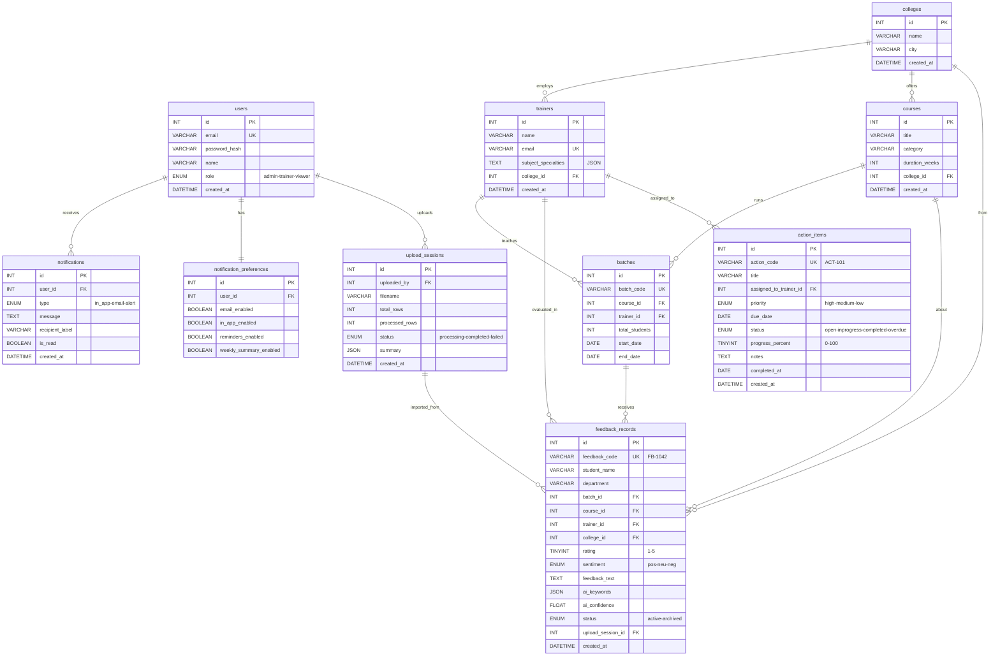

# MySQL Database Schema — Profice Feedback Analyzer

## ER Diagram



---

## Table-by-Table Schema

---

### 1. `users`

**Used by**: Auth, Notifications

| Column | Type | Constraints | Description |
|---|---|---|---|
| `id` | `INT` | PK, AUTO_INCREMENT | |
| `email` | `VARCHAR(255)` | UNIQUE, NOT NULL | Login email |
| `password_hash` | `VARCHAR(255)` | NOT NULL | bcrypt hashed |
| `name` | `VARCHAR(100)` | NOT NULL | Display name |
| `role` | `ENUM('admin','trainer','viewer')` | NOT NULL, DEFAULT `'admin'` | Access level |
| `created_at` | `DATETIME` | DEFAULT `CURRENT_TIMESTAMP` | |

---

### 2. `colleges`

**Used by**: Repository filters, Trainer Insights, Course Insights

| Column | Type | Constraints | Description |
|---|---|---|---|
| `id` | `INT` | PK, AUTO_INCREMENT | |
| `name` | `VARCHAR(255)` | UNIQUE, NOT NULL | e.g. "PSG College of Technology" |
| `city` | `VARCHAR(100)` | | e.g. "Coimbatore" |
| `created_at` | `DATETIME` | DEFAULT `CURRENT_TIMESTAMP` | |

**Seed data from your frontend**:
```
1 → PSG College of Technology (Coimbatore)
2 → Coimbatore Institute of Technology (Coimbatore)
3 → Government College of Technology (Coimbatore)
```

---

### 3. `trainers`

**Used by**: Trainer Insights, Repository filters, Action Tracker

| Column | Type | Constraints | Description |
|---|---|---|---|
| `id` | `INT` | PK, AUTO_INCREMENT | |
| `name` | `VARCHAR(100)` | NOT NULL | e.g. "Dr. Kumar" |
| `email` | `VARCHAR(255)` | UNIQUE | |
| `subject_specialties` | `JSON` | | e.g. `["Machine Learning", "Data Structures"]` |
| `college_id` | `INT` | FK → `colleges.id` | Which college they belong to |
| `created_at` | `DATETIME` | DEFAULT `CURRENT_TIMESTAMP` | |

**Indexes**: `college_id`

**Seed data**:
```
1 → Karthik S   (PSG)   — MERN Stack & Python
2 → Priya N     (PSG)   — Data Science
3 → Arjun D     (CIT)   — UI/UX Design
4 → Meera J     (GCT)   — Cloud Computing
5 → Dr. Kumar   (PSG)   — ML & AI, DSA, Ethical Hacking, VLSI
6 → Prof. Priya (PSG)   — Java, Embedded Systems, Software Testing, AI
7 → Dr. Arjun   (CIT)   — Quantum Computing, Python, Compiler Design, Crypto
8 → Prof. Meena (GCT)   — Python, Cloud Computing, Big Data
```

---

### 4. `courses`

**Used by**: Course Insights, Repository filters, Batch Insights

| Column | Type | Constraints | Description |
|---|---|---|---|
| `id` | `INT` | PK, AUTO_INCREMENT | |
| `title` | `VARCHAR(255)` | NOT NULL | e.g. "MERN Stack Development" |
| `category` | `VARCHAR(100)` | | e.g. "Web Development" |
| `duration_weeks` | `INT` | | e.g. 12 |
| `college_id` | `INT` | FK → `colleges.id` | |
| `created_at` | `DATETIME` | DEFAULT `CURRENT_TIMESTAMP` | |

**Indexes**: `college_id`

---

### 5. `batches`

**Used by**: Batch Insights, Reports filters

| Column | Type | Constraints | Description |
|---|---|---|---|
| `id` | `INT` | PK, AUTO_INCREMENT | |
| `batch_code` | `VARCHAR(50)` | UNIQUE, NOT NULL | e.g. "MERN-B12" |
| `course_id` | `INT` | FK → `courses.id` | |
| `trainer_id` | `INT` | FK → `trainers.id` | |
| `total_students` | `INT` | DEFAULT `0` | e.g. 32 |
| `start_date` | `DATE` | | |
| `end_date` | `DATE` | | |

**Indexes**: `course_id`, `trainer_id`

**Seed data**:
```
MERN-B12  → MERN Stack   → Karthik S → 32 students
DS-B07    → Data Science  → Priya N   → 28 students
UIUX-B05  → UI/UX Design → Arjun D   → 24 students
CLOUD-B09 → Cloud Comp.   → Meera J   → 30 students
PY-B14    → Python Prog.  → Karthik S → 35 students
MERN-B13  → MERN Stack   → Priya N   → 29 students
```

---

### 6. `feedback_records` ⭐ (Main Table)

**Used by**: Dashboard, Repository, AI Analysis, Trainer Insights, Course Insights, Reports — **every module reads from this**

| Column | Type | Constraints | Description |
|---|---|---|---|
| `id` | `INT` | PK, AUTO_INCREMENT | |
| `feedback_code` | `VARCHAR(20)` | UNIQUE, NOT NULL | e.g. "FB-1042" |
| `student_name` | `VARCHAR(100)` | NOT NULL | |
| `department` | `VARCHAR(100)` | | e.g. "Computer Applications" |
| `batch_id` | `INT` | FK → `batches.id`, NULLABLE | |
| `course_id` | `INT` | FK → `courses.id` | |
| `trainer_id` | `INT` | FK → `trainers.id` | |
| `college_id` | `INT` | FK → `colleges.id` | |
| `rating` | `TINYINT` | NOT NULL, CHECK (1-5) | Star rating |
| `sentiment` | `ENUM('positive','neutral','negative')` | NOT NULL | **AI-classified** |
| `feedback_text` | `TEXT` | NOT NULL | Raw student feedback |
| `ai_keywords` | `JSON` | NULLABLE | AI-extracted: `["teaching","practical","doubt"]` |
| `ai_confidence` | `FLOAT` | NULLABLE | AI confidence: 0.0 to 1.0 |
| `status` | `ENUM('active','archived')` | NOT NULL, DEFAULT `'active'` | |
| `upload_session_id` | `INT` | FK → `upload_sessions.id`, NULLABLE | Which upload brought this in |
| `created_at` | `DATETIME` | DEFAULT `CURRENT_TIMESTAMP` | Submission date |

**Indexes** (critical for 10K+ performance):
```sql
INDEX idx_college       (college_id)
INDEX idx_course        (course_id)
INDEX idx_trainer       (trainer_id)
INDEX idx_batch         (batch_id)
INDEX idx_sentiment     (sentiment)
INDEX idx_rating        (rating)
INDEX idx_status        (status)
INDEX idx_created_at    (created_at)
INDEX idx_upload        (upload_session_id)
FULLTEXT INDEX idx_search (feedback_text, student_name)
```

**How each module queries this table**:

```
Dashboard       → SELECT COUNT(*), AVG(rating), GROUP BY sentiment, month
Repository      → SELECT * WHERE college + course + trainer + sentiment + rating + date + search
Trainer Insights→ SELECT AVG(rating), COUNT(*) WHERE trainer_id = ?  GROUP BY month
Course Insights → SELECT AVG(rating) WHERE course_id = ?  GROUP BY month
Reports         → Same as Repository with export
AI Analysis     → SELECT COUNT(*) GROUP BY sentiment (teammate does the RAG part)
```

---

### 7. `action_items`

**Used by**: Action Tracker

| Column | Type | Constraints | Description |
|---|---|---|---|
| `id` | `INT` | PK, AUTO_INCREMENT | |
| `action_code` | `VARCHAR(20)` | UNIQUE, NOT NULL | e.g. "ACT-101" |
| `title` | `VARCHAR(255)` | NOT NULL | e.g. "Add more practical sessions" |
| `assigned_to_trainer_id` | `INT` | FK → `trainers.id` | |
| `priority` | `ENUM('high','medium','low')` | NOT NULL, DEFAULT `'medium'` | |
| `due_date` | `DATE` | NOT NULL | |
| `status` | `ENUM('open','in-progress','completed','overdue')` | NOT NULL, DEFAULT `'open'` | |
| `progress_percent` | `TINYINT` | DEFAULT `0`, CHECK (0-100) | |
| `notes` | `TEXT` | | |
| `completed_at` | `DATE` | NULLABLE | Set when status = completed |
| `created_at` | `DATETIME` | DEFAULT `CURRENT_TIMESTAMP` | |

**Indexes**: `assigned_to_trainer_id`, `status`, `priority`, `due_date`

---

### 8. `notifications`

**Used by**: Notifications

| Column | Type | Constraints | Description |
|---|---|---|---|
| `id` | `INT` | PK, AUTO_INCREMENT | |
| `user_id` | `INT` | FK → `users.id` | Who receives it |
| `type` | `ENUM('in-app','email','alert')` | NOT NULL | Channel type |
| `message` | `TEXT` | NOT NULL | Notification text |
| `recipient_label` | `VARCHAR(100)` | | e.g. "Karthik S (Trainer)" |
| `is_read` | `BOOLEAN` | DEFAULT `FALSE` | Read/unread state |
| `created_at` | `DATETIME` | DEFAULT `CURRENT_TIMESTAMP` | |

**Indexes**: `user_id`, `type`, `is_read`, `created_at`

---

### 9. `notification_preferences`

**Used by**: Notifications (Quick Settings)

| Column | Type | Constraints | Description |
|---|---|---|---|
| `id` | `INT` | PK, AUTO_INCREMENT | |
| `user_id` | `INT` | FK → `users.id`, UNIQUE | One row per user |
| `email_enabled` | `BOOLEAN` | DEFAULT `TRUE` | |
| `in_app_enabled` | `BOOLEAN` | DEFAULT `TRUE` | |
| `reminders_enabled` | `BOOLEAN` | DEFAULT `TRUE` | |
| `weekly_summary_enabled` | `BOOLEAN` | DEFAULT `TRUE` | |

---

### 10. `upload_sessions`

**Used by**: AI Analysis (upload tracking)

| Column | Type | Constraints | Description |
|---|---|---|---|
| `id` | `INT` | PK, AUTO_INCREMENT | |
| `uploaded_by` | `INT` | FK → `users.id` | Who uploaded |
| `filename` | `VARCHAR(255)` | NOT NULL | e.g. "july_feedback.xlsx" |
| `total_rows` | `INT` | DEFAULT `0` | Rows in the file |
| `processed_rows` | `INT` | DEFAULT `0` | Rows successfully stored |
| `status` | `ENUM('processing','completed','failed')` | DEFAULT `'processing'` | |
| `summary` | `JSON` | NULLABLE | `{"positive":65,"neutral":22,"negative":13}` |
| `created_at` | `DATETIME` | DEFAULT `CURRENT_TIMESTAMP` | |

**Indexes**: `uploaded_by`, `status`

---

## Prisma Schema (Ready to Use)

```prisma
generator client {
  provider = "prisma-client-js"
}

datasource db {
  provider = "mysql"
  url      = env("DATABASE_URL")
}

model User {
  id            Int       @id @default(autoincrement())
  email         String    @unique @db.VarChar(255)
  passwordHash  String    @map("password_hash") @db.VarChar(255)
  name          String    @db.VarChar(100)
  role          UserRole  @default(admin)
  createdAt     DateTime  @default(now()) @map("created_at")

  notifications           Notification[]
  notificationPreferences NotificationPreference?
  uploadSessions          UploadSession[]

  @@map("users")
}

enum UserRole {
  super_admin     @map("super_admin")
  management      @map("management")
  program_manager @map("program_manager")
  trainer         @map("trainer")
  ace_lead        @map("ace_lead")
}

model College {
  id        Int       @id @default(autoincrement())
  name      String    @unique @db.VarChar(255)
  city      String?   @db.VarChar(100)
  createdAt DateTime  @default(now()) @map("created_at")

  trainers        Trainer[]
  courses         Course[]
  feedbackRecords FeedbackRecord[]

  @@map("colleges")
}

model Trainer {
  id                  Int       @id @default(autoincrement())
  name                String    @db.VarChar(100)
  email               String?   @unique @db.VarChar(255)
  subjectSpecialties  Json?     @map("subject_specialties")
  collegeId           Int       @map("college_id")
  createdAt           DateTime  @default(now()) @map("created_at")

  college         College          @relation(fields: [collegeId], references: [id])
  batches         Batch[]
  feedbackRecords FeedbackRecord[]
  actionItems     ActionItem[]

  @@index([collegeId])
  @@map("trainers")
}

model Course {
  id            Int       @id @default(autoincrement())
  title         String    @db.VarChar(255)
  category      String?   @db.VarChar(100)
  durationWeeks Int?      @map("duration_weeks")
  collegeId     Int       @map("college_id")
  createdAt     DateTime  @default(now()) @map("created_at")

  college         College          @relation(fields: [collegeId], references: [id])
  batches         Batch[]
  feedbackRecords FeedbackRecord[]

  @@index([collegeId])
  @@map("courses")
}

model Batch {
  id            Int       @id @default(autoincrement())
  batchCode     String    @unique @map("batch_code") @db.VarChar(50)
  courseId       Int       @map("course_id")
  trainerId      Int       @map("trainer_id")
  totalStudents  Int       @default(0) @map("total_students")
  startDate      Date?     @map("start_date")
  endDate        Date?     @map("end_date")

  course          Course           @relation(fields: [courseId], references: [id])
  trainer         Trainer          @relation(fields: [trainerId], references: [id])
  feedbackRecords FeedbackRecord[]

  @@index([courseId])
  @@index([trainerId])
  @@map("batches")
}

model FeedbackRecord {
  id              Int             @id @default(autoincrement())
  feedbackCode    String          @unique @map("feedback_code") @db.VarChar(20)
  studentName     String          @map("student_name") @db.VarChar(100)
  department      String?         @db.VarChar(100)
  batchId         Int?            @map("batch_id")
  courseId        Int             @map("course_id")
  trainerId       Int             @map("trainer_id")
  collegeId       Int             @map("college_id")
  rating          Int             @db.TinyInt
  sentiment       Sentiment
  feedbackText    String          @map("feedback_text") @db.Text
  aiKeywords      Json?           @map("ai_keywords")
  aiConfidence    Float?          @map("ai_confidence")
  status          FeedbackStatus  @default(active)
  uploadSessionId Int?            @map("upload_session_id")
  createdAt       DateTime        @default(now()) @map("created_at")

  batch         Batch?         @relation(fields: [batchId], references: [id])
  course        Course         @relation(fields: [courseId], references: [id])
  trainer       Trainer        @relation(fields: [trainerId], references: [id])
  college       College        @relation(fields: [collegeId], references: [id])
  uploadSession UploadSession? @relation(fields: [uploadSessionId], references: [id])

  @@index([collegeId])
  @@index([courseId])
  @@index([trainerId])
  @@index([batchId])
  @@index([sentiment])
  @@index([rating])
  @@index([status])
  @@index([createdAt])
  @@index([uploadSessionId])
  @@map("feedback_records")
}

enum Sentiment {
  positive
  neutral
  negative
}

enum FeedbackStatus {
  active
  archived
}

model ActionItem {
  id                   Int          @id @default(autoincrement())
  actionCode           String       @unique @map("action_code") @db.VarChar(20)
  title                String       @db.VarChar(255)
  assignedToTrainerId  Int          @map("assigned_to_trainer_id")
  priority             Priority     @default(medium)
  dueDate              DateTime     @map("due_date") @db.Date
  status               ActionStatus @default(open)
  progressPercent      Int          @default(0) @map("progress_percent") @db.TinyInt
  notes                String?      @db.Text
  completedAt          DateTime?    @map("completed_at") @db.Date
  createdAt            DateTime     @default(now()) @map("created_at")

  assignedTo Trainer @relation(fields: [assignedToTrainerId], references: [id])

  @@index([assignedToTrainerId])
  @@index([status])
  @@index([priority])
  @@index([dueDate])
  @@map("action_items")
}

enum Priority {
  high
  medium
  low
}

enum ActionStatus {
  open
  @map("in-progress") in_progress
  completed
  overdue
}

model Notification {
  id             Int              @id @default(autoincrement())
  userId         Int              @map("user_id")
  type           NotificationType
  message        String           @db.Text
  recipientLabel String?          @map("recipient_label") @db.VarChar(100)
  isRead         Boolean          @default(false) @map("is_read")
  createdAt      DateTime         @default(now()) @map("created_at")

  user User @relation(fields: [userId], references: [id])

  @@index([userId])
  @@index([type])
  @@index([isRead])
  @@index([createdAt])
  @@map("notifications")
}

enum NotificationType {
  @map("in-app") in_app
  email
  alert
}

model NotificationPreference {
  id                   Int     @id @default(autoincrement())
  userId               Int     @unique @map("user_id")
  emailEnabled         Boolean @default(true) @map("email_enabled")
  inAppEnabled         Boolean @default(true) @map("in_app_enabled")
  remindersEnabled     Boolean @default(true) @map("reminders_enabled")
  weeklySummaryEnabled Boolean @default(true) @map("weekly_summary_enabled")

  user User @relation(fields: [userId], references: [id])

  @@map("notification_preferences")
}

model UploadSession {
  id            Int          @id @default(autoincrement())
  uploadedBy    Int          @map("uploaded_by")
  filename      String       @db.VarChar(255)
  totalRows     Int          @default(0) @map("total_rows")
  processedRows Int          @default(0) @map("processed_rows")
  status        UploadStatus @default(processing)
  summary       Json?
  createdAt     DateTime     @default(now()) @map("created_at")

  uploader        User             @relation(fields: [uploadedBy], references: [id])
  feedbackRecords FeedbackRecord[]

  @@index([uploadedBy])
  @@index([status])
  @@map("upload_sessions")
}

enum UploadStatus {
  processing
  completed
  failed
}
```

---

## Which Table Feeds Which Frontend Page

```
┌─────────────────────┐
│     Dashboard       │ ← feedback_records (aggregations)
├─────────────────────┤
│  Feedback Repository│ ← feedback_records + colleges + trainers + courses
├─────────────────────┤
│    AI Analysis      │ ← feedback_records + upload_sessions
├─────────────────────┤
│  Trainer Insights   │ ← trainers + feedback_records + colleges
├─────────────────────┤
│   Course Insights   │ ← courses + feedback_records + colleges
├─────────────────────┤
│   Batch Insights    │ ← batches + courses + trainers
├─────────────────────┤
│      Reports        │ ← feedback_records + trainers + courses + batches
├─────────────────────┤
│   Action Tracker    │ ← action_items + trainers
├─────────────────────┤
│   Notifications     │ ← notifications + notification_preferences + users
└─────────────────────┘
```
